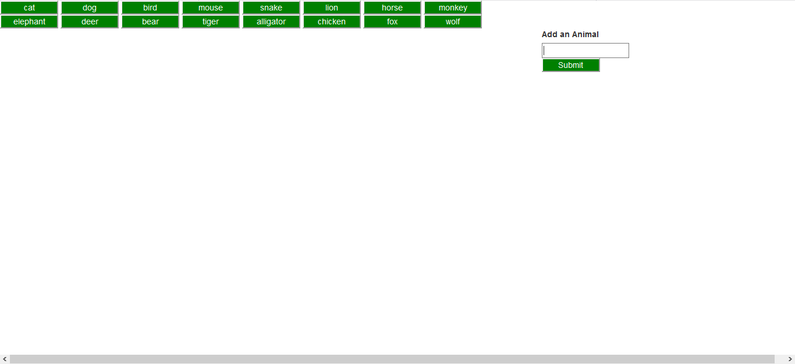
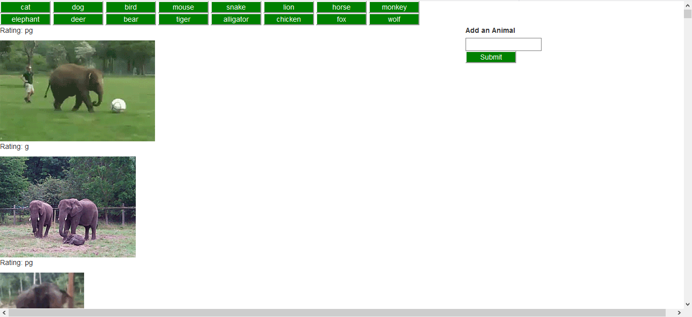
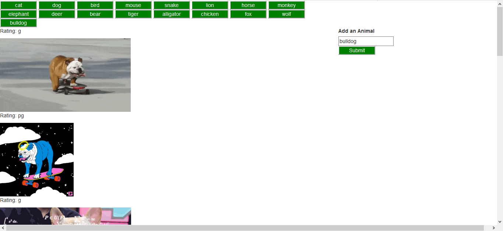

# GifTastic Animals

An application which allows the user to view, animate, and add GIF's of various animals from the GIPHY API.

## How to Use

User opens the application via the GitHub Pages [link](https://wespres1990.github.io/GifTastic-Animals/), which displays a dynamic web page and features an array of buttons labeled with various animals.

When the user clicks on a button, the page generates 10 static, non-animated GIF images from the GIPHY API and place them on the page. When the still GIPHY images are clicked by the user, they should animate, and then stop playing if the user clicks the GIF's again. Additionally, the user may add more animals and generate GIF's of said animals.

Furthermore, every GIF displays its rating (PG, G, and so on), and this data is provided by the GIPHY API.

### Technologies Used

Languages - HTML5, CSS4, JavaScript

Libraries - Bootstrap, jQuery

Other tools, technologies, and techniques - AJAX, GIPHY API

Text Editor - Visual Studio Code

## Preview

### Opening Page
- - - -

### Animal Chosen from Array
- - - -

### Animal Added to Array
- - - -

## Contributing

Please feel free to branch off with tweaks and making a repo; open to suggestions for improvement!

## Future Development

* Organize page so that there is more than one GIF per row - as many as space will allow.
* Additional styling.

## Authors

* **Wesley Hutchins** - [Github](https://github.com/WesPres1990)